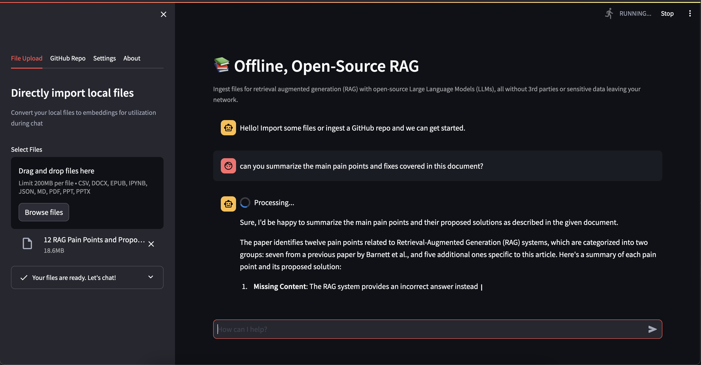

# 📚 Local RAG

Offline, Open-Source RAG

Ingest files for retrieval augmented generation (RAG) with open-source Large Language Models (LLMs), all without 3rd parties or sensitive data leaving your network.

### Pre-Requisites

- A pre-existing Ollama instance
- Python 3.9+

### Getting Started

- `pip install pipenv && pipenv install`
- `pipenv shell && streamlit run main.py`

### To Do
- [x] Refactor
- [x] Migrate chat stream to llama-index
- [x] Implement llama-index Chat Engine with memory
- [ ] Swap to llama-index Chat Engine
- [x] Function to handle file embeddings
- [ ] Allow Switching of Embedding Model
- [ ] Delete Files after Index created
- [ ] Ability to Remove Files from Index
- [ ] Function to handle GitHub repo ingestion
- [ ] Support for JSON files
- [x] Show Loaders in UI (file uploads, conversions, ...)
- [X] Export Data (uploaded files, chat history, ...)
- [x] View and Manage Imported Files
- [x] About Tab in Sidebar
- [ ] Docker Support
- [ ] Implement Log Library
- [ ] Cookies/Local-Storage for State

### Resources
- [Ollama](https://ollama.com/)
- [Llama-Index](https://docs.llamaindex.ai/en/stable/index.html)
- [Streamlit](https://docs.streamlit.io/library/api-reference)
- [Ollama w/ Llama-Index](https://docs.llamaindex.ai/en/stable/examples/llm/ollama.html)
- [RAG w/ Llama-Index](https://blog.streamlit.io/build-a-chatbot-with-custom-data-sources-powered-by-llamaindex/)
- [Llama-Index Chat Engine](https://docs.llamaindex.ai/en/stable/examples/chat_engine/chat_engine_context.html)